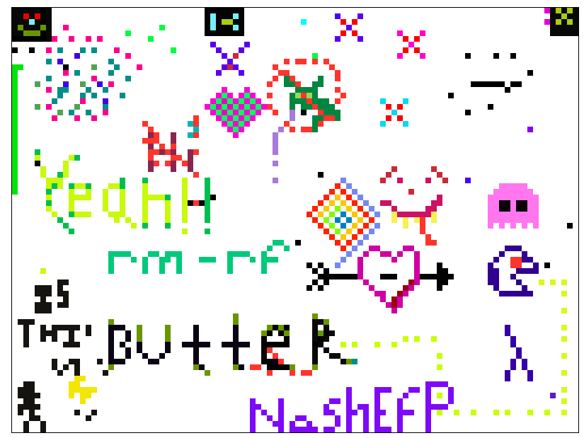

# realtime-pixelart

A real time pixel art editor using Elixir, Phoenix and Elm

To start your Phoenix server:

  * Install dependencies with `mix deps.get`
  * Install Frontend dependencies with `cd assets && yarn install`
  * Start Phoenix endpoint with `mix phx.server`

Now you can visit [`localhost:4000`](http://localhost:4000) from your browser.